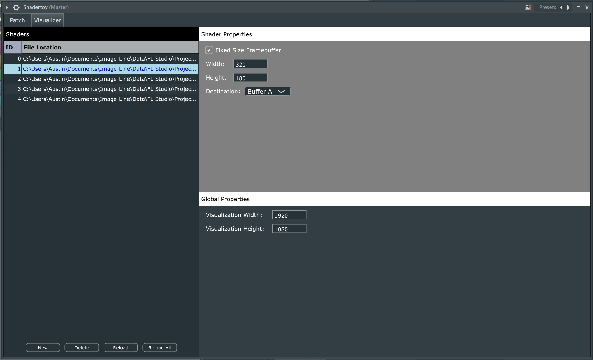
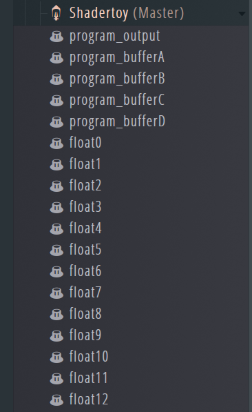

## GUI

The GUI for ShadertoyVST is pretty simple at the moment. The VST window is
split up into two tabs - the patch editor, and the visualization output.

The patch editor is split up into three sections:
- On the left-hand side you have the list of shaders. Each shader is assigned
an ID and a file location. Buttons on the bottom allow you to load, delete,
and reload shaders to the list.
- In the top-right you have shader-specific properties, such as which output
framebuffer the shader renders to and, if desired, a fixed width and height
for the output.
- In the bottom-right you have global properties. Right now this is just the
size of the visualization output.

## Parameters

The list of parameters is as such:

- The program IDs of the active shaders for each of the output and auxiliary
buffers (BufferA..D)
- Floating point parameters between 0..1
- Integer parameters between 0..100

The floating point and integer parameters' names map to uniforms in the GLSL
shader. Uniforms must have the correct name and type, otherwise ShadertoyVST
will display an error. Because of a limitation in JUCE, it is not possible to
read back uniform names and display them as parameters to the DAW - parameters
need to be defined on VST startup, so a fixed number of parameters with fixed
names are exposed.

To make your GLSL code a bit more understandable, it is recommended that you
alias uniform names using the #define directive.

## GLSL Intrinsics

In addition to parameter uniforms, ShadertoyVST also exposes the set of
intrinsic uniforms defined below:

- `vec2 iResolution` - The active resolution of the output framebuffer
- `vec2 iResolutionBufferA..D` - The active resolution of each auxiliary framebuffer
- `sampler2D iBufferA..D` - The sampler2D representations of the auxiliary framebuffers
- `float iKeyDown[128]` - An array of the times the last key down events occurred on each MIDI key.
- `float iKeyUp[128]` - Like iKeyDown, except for key up events.
- `float iKeyDownVelocity[128]` - The velocity of the last key down event
- `float iKeyUpVelocity[128]` - The velocity of the last key up event
- `float iPitchWheel` - The orientation of the pitch wheel, normalized between 0.0 and 1.0.
- `float iSustainPedal` - Whether the sustain pedal is on, 0.0 or 1.0.
- `float iSostenutoPedal` - Whether the sostenuto pedal is on, 0.0 or 1.0.
- `float iSoftPedal` - Whether the soft pedal is on, 0.0 or 1.0.
- `float iTime` - The current render time. Note that this is not the same as playlist or sequencer time.
- `float iSampleRate` - The sample rate of the input audio stream.
- `float iAudioChannel0..1[]` - An array of the last N samples for each audio channel. N can range from 16 to 2048.

## Auxiliary Buffers

Like https://www.shadertoy.com/ there are four additional buffers for multipass
rendering algorithms. These buffers are processed in order from iBufferA to iBufferD.
A shader rendering to these buffers can use any of the other auxiliary output buffers
as input, but not itself. And of course, the output framebuffer has access to all four
auxiliary buffers.

The behavior is as such that if you were to feed a subsequent buffer into an antecedent
buffer (for example, iBufferD into iBufferA), you would be reading the previous frame's
contents for iBufferD. This is useful if you have a rendering algorithm with a dependency
on the previous frame.